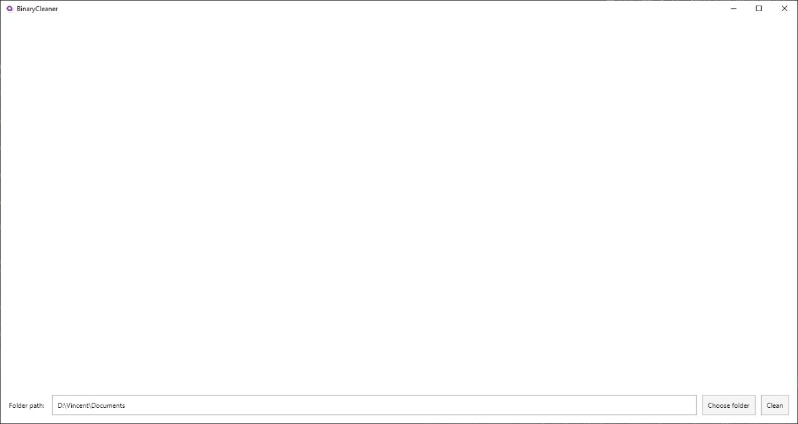
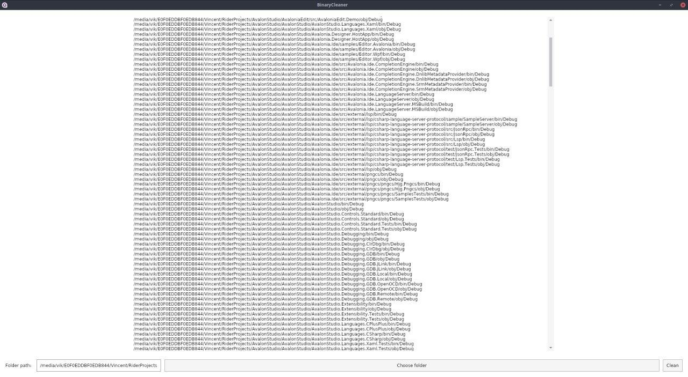

# BinaryCleaner
BinaryCleaner is cross-platform [open-source](https://github.com/negator92/BinaryCleaner/blob/master/LICENSE) software built with [Avalonia](https://github.com/AvaloniaUI/Avalonia).

App can clean \bin, \obj recursive in folder you choose (where C# projects stores).

# Views

## First screen

## Cleaning example

# To-do

* asyncronus
* loader
* ...
* style
* add local nuget clean

# How to build

 * dotnet clean
 * dotnet restore
 * dotnet build -c release

# Run

 * dotnet run

# On debug

 * dotnet watch run
